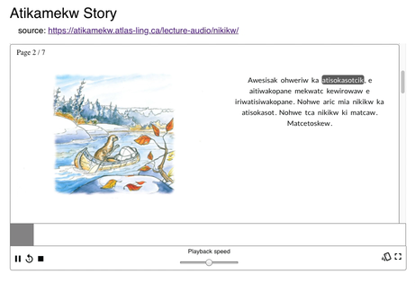

# ICLDC "Readalongs" Workshop documentation

Welcome, participants of the "'Watch Me Speak!' interactive storytelling using ReadAlong Studio" workshop!  These documents will help you understand what Readalong Studio is and how to prepare for the workshop.

## What is Readalong Studio?

Readalong Studio is software program (actually a collection of programs) to help you make and view online "read-along" and "sing-along" audiobooks for language and literacy education.  As the audio plays, the word currently being spoken is highlighted, and the student can click on any word to hear it pronounced in isolation.

You give the software two things, the text of the story, and a recording of someone speaking the story aloud.  Inside, the software listens to the recording and tries to guess the exact time when each word starts and stops.  (If you've ever used audio software like Audacity or ELAN, imagine measuring the exact time when every word starts and stops.  You could totally do this, but it takes a long time and is very boring, it usually takes about an hour to measure a minute of speech!)  Our software's guesses aren't perfect, but it can make these guesses in seconds, saving you a ton of time.

## What do I need to prepare before the workshop?

We've covered this in the [Workshop Preparation](workshop-prep.md) page.

## How about during the workshop?

In case you missed something during the presentation or need to go into more depth about a topic, we'll be putting more detailed instructions [here](during-workshop.md).  But there's nothing there right now.

