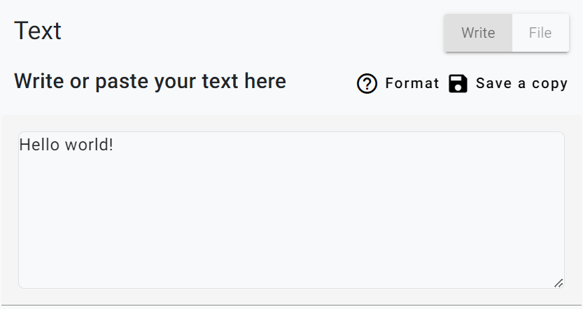
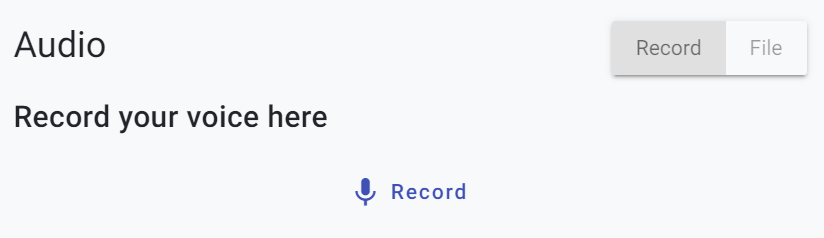
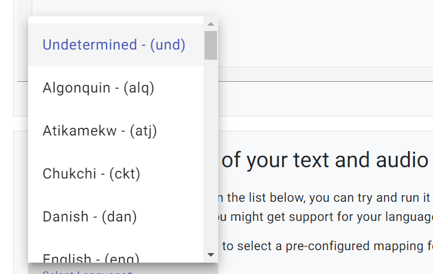
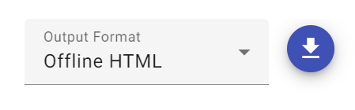

# Instructions for during the workshop

All the information you need to use the software will be explained during the live workshop.  It'll be more clear seeing/hearing someone use the software, compared to reading about it.  This is just for people who missed that part, have run into trouble, or need something explained in greater depth.

## Requirements

As mentioned in [Workshop Preparation], you'll need a desktop or laptop computer; we don't recommend trying to *create* a readalong using a phone or tablet.  (You can view the results on a phone or tablet, but not all parts of the creation software work on all phones/tablets.)

## Starting from scratch

Did you bring a recorded story to make a readalong?  If so, good!  But either way, we're going to start by recording a little sample story from scratch first, to get the hang of the software.  Afterward, you can try putting in your pre-recorded story.

To make a readalong, we need both the text of a story and a recording of it.  

## Step 1: Enter some text

Let's start by writing the text.  Type a sentence in the text area, seen below.

If you want to have multiple lines on one "page" of your readalong, you can do so; a single return (i.e., the "enter" key on your keyboard) will give you another line on the same page.  

     This will be a line
     This will be another line on the same page 

If you want to have multiple pages in your readalong, two returns will put the line on the next page.  

     This will be a line

     This will be a line on the next page

If you have a *ton* of stuff to write, though, we advise against writing it all in the browser like this.  This is just a browser window, and if you close the window and come back later, it's gone forever.  We provide a "Save a copy" button just in case, that will download what you wrote as a .TXT file for later, just so you don't lose it.

If you *do* have the file in .TXT format already, or you want to re-upload a .TXT file that you saved a copy of earlier, click on "File" instead of "Write".  This will give you the option to upload a text file from your computer.

## Step 2: Record some audio

Now that you have some text, it's time to make a recording of it.  Hit the "Record" button and start speaking.  (Your browser might ask permission for you to use the microphone first.)  When you've finished, pressed "Stop".

The recorder is sometimes a bit finicky or makes mistakes (for example, sometimes it takes a moment or two to start, and can miss your first word or two).  Press "Play" to listen to it to make sure it captured everything you said.  Also be on the listen for any background noise, like someone talking in the background.  (The software gets understandably confused when there are multiple voices, it doesn't know which one is the one it's supposed to be paying attention to.)  If the recording didn't quite work out, click "Delete and re-record" and try again.

The same as the text above, this recording only exists in your browser temporarily, and if you close the window it'll be lost.  So again, we give you a "Save a copy" button just in case.  

Again, similar to text, if you already have a recording, or you want to re-upload one you saved from here previously, there's an option to upload it.  Choose "File" rather than "Record" to upload a recording saved on your computer.

## Step 3: Select your language

Open the language menu and see if your language is already included.  If it is, select it, but if it isn't, that's usually not a big deal.  You can select Undetermined instead and the software will make its best guesses about what the words sound like.

If you'd like to know more about how we handle Undetermined languages, and whether this option is likely to work with your languages, check out our detailed description in [Supported Languages](languages.md)

### Align it!

Click "Go to the next step".  The software will then attempt to align the text you entered with the recording you made.  On the next page you should see a readalong, press play to see how well it aligned!

If the alignment fails and you get an error message, or if the resulting alignments are poor quality, here are some of the most common problems:

* Audio and text that don't exactly correspond (for example, something in the text that wasn't read aloud)
* Too long of a story (once you get up past 10 minutes, errors become more common
* Numbers and symbols in the text 
* Background noise

These issues are explained further in [Troubleshooting](troubleshooting.md)

## Add decorations

You can now add a title, a subtitle, and an image for each page.

You can also add a translation for each line (or a gloss, or any other information).  Just press the "+" button next to each line and you'll be given a place to type in the translation.

## Download it

In the upper right corner there's a download button:

You can choose one of several formats.  We just want the default "Offline HTML" for now.  That bundles all the text, audio, and images into a self-contained HTML file that you can put on a web page.

(The other formats are used for subtitling videos or for descriptive/academic research; they're not immediately relevant to the goals of this workshop.)